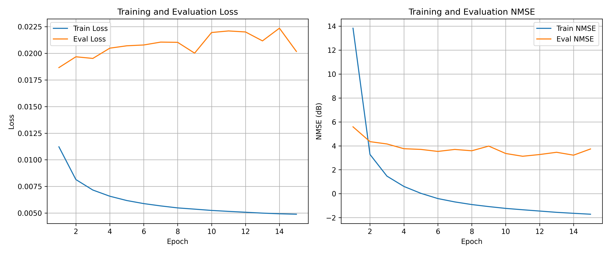
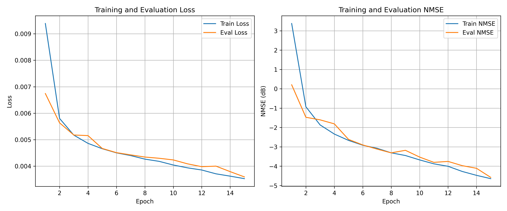
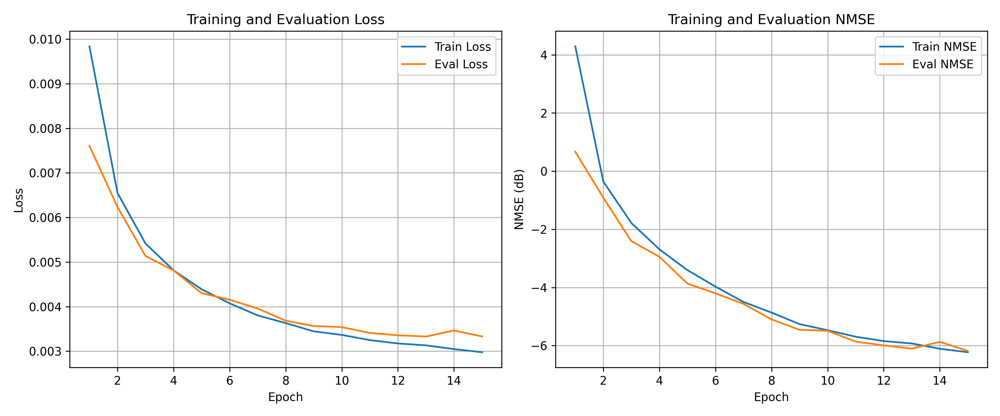

## env
    139.9416909621 186.5889212828 93.2944606414   ! RL: 방 크기
    1/2, 1/4 , 1/2 sound source
    1/2 , 2/4 , 1/2 speaker
    1/2 , 3/4 , 1/2 error mic

-------------------------------------------------------------------------------
## 발표 시점(first)
    activation = ReLU
    batchnorm 적용
    데이터 길이 1초

-----------------------------------------------------------------------------------
## 발표 시점에서 추측한 것
    skip connection이 입출력의 시간축이 맞지 않아 좋지 않은 영향을 미칠거라고 생각했으나 skip connection을 빼니 오히려 더 NMSE가 증가하는 모습을 보임 -> skip을 적용하는게 성능이 훨씬 도움이 됨
    모델의 입출력의 분포를 체크 했을 때 rir 적용 후 -1.5~1.5 사이인 것을 보아 입출력에 정규화를 진행할 필요는 없어보임

---------------------------------------------------------------------------------------------    
## 성능이 좋지 않았던 진짜 이유
    단순히 eval 코드를 잘못짜서... 오류를 수정하고 데이터 길이를 5초로 늘리니 좋은 결과를 얻을 수 있었다.

------------------------------------------------------------------------------------------------------------------
## dataset
    vehicle dataset 으로 한정 (5초 단위)
    train dataset: 10000개
    eval dataset: 1000개
## model

## training loop

## 5th result
    activation = ReLU
    batchnorm 적용
    5th 부터 데이터 길이 5초로 늘림

## 6th result
    activation = ReLU
    batchnorm 삭제 , 이미 입출력이 특정 범위로 제한되어 있어 불필요 하고, 제거하니 성능이 더 오름

## 7th result
    activation = ELU
    batchnorm 삭제

## 이후 해볼 수 있는 것
    데이터 증강 및 epoch 늘리기
    3~8초로 가변 길이 적용, 8초까지 0 패딩
    fp16으로 빠르게 모델 학습
    ReLU를 써도 성능저하는 크지 않을 것 같음, 연산 이점을 얻을 수 있을 것 같음

---------------------------------------
## 마지막결과 
    final result에 마지막 결과 저장
---------------------------------------
