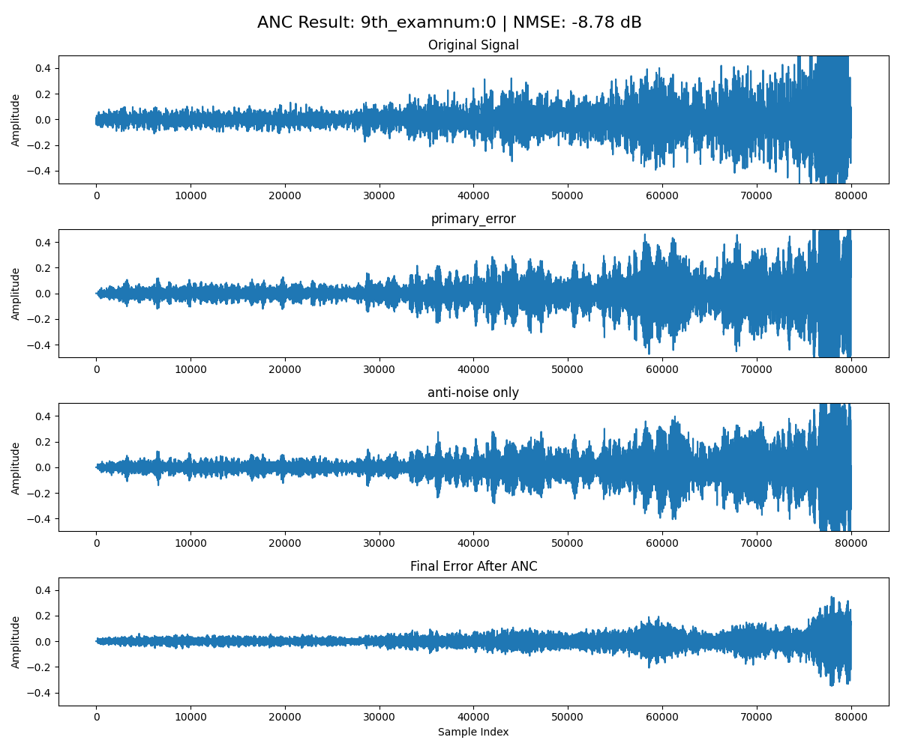
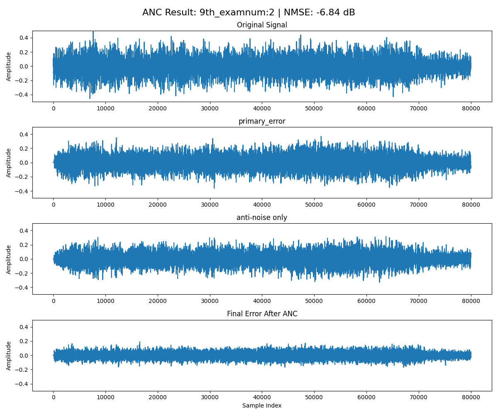
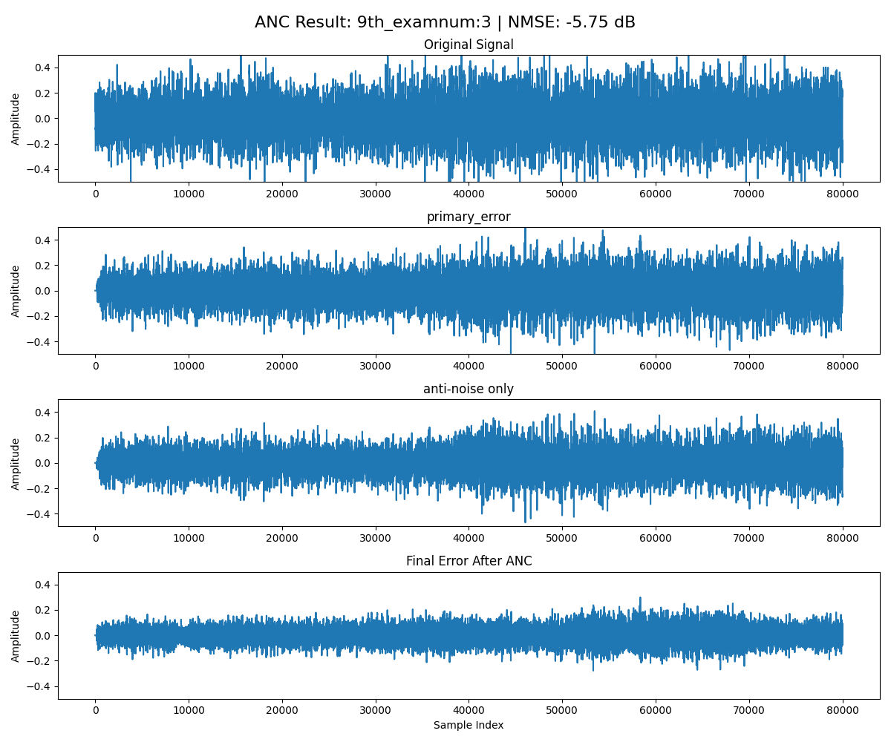
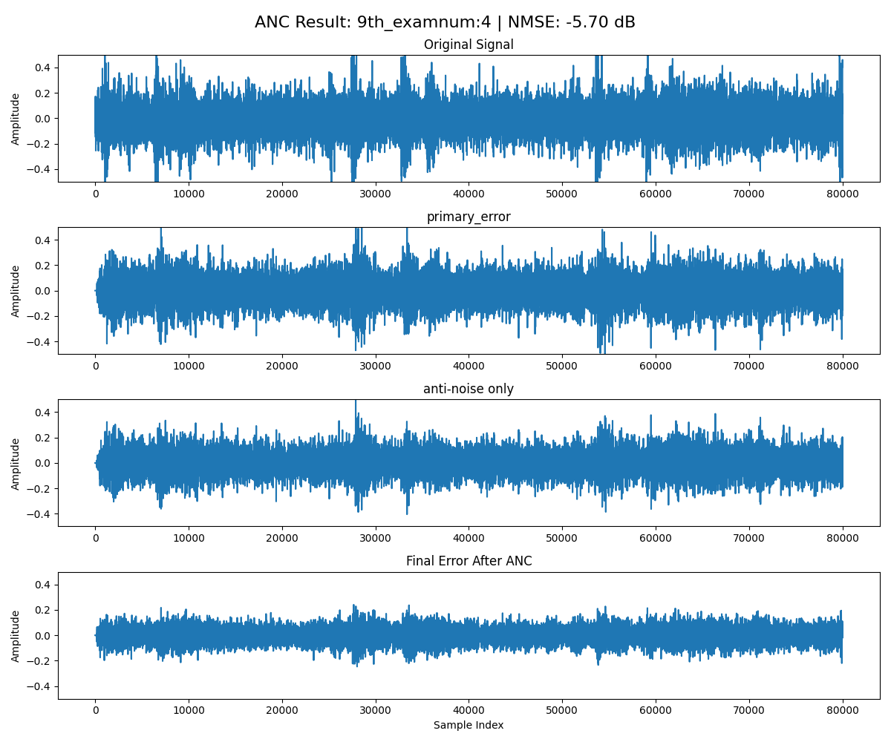

## Zhang & Wang paper
    Zhang & Wang의 논문  
    "A Deep Learning Approach to Active Noise Control" (INTERSPEECH 2020) 
    을 기반으로 한 ANC(Active Noise Control) 시스템을 구현한 결과입니다.
[논문 바로 보기 (PDF)](https://www.isca-archive.org/interspeech_2020/zhang20i_interspeech.pdf)

## env
    139.9416909621 186.5889212828 93.2944606414   ! RL: 방 크기
    sound source 위치: 1/2, 1/4 , 1/2 
    speaker 위치: 1/2 , 2/4 , 1/2 
    error mic 위치: 1/2 , 3/4 , 1/2 

## 발표 시점(first)
    activation = ReLU
    batchnorm 적용
    데이터 길이 1초

## 발표 시점에서 추측한 것
    skip connection이 입출력의 시간축이 맞지 않아 좋지 않은 영향을 미칠거라고 생각했으나 skip connection을 빼니 오히려 더 NMSE가 증가하는 모습을 보임 -> skip을 적용하는게 성능이 훨씬 도움이 됨
    모델의 입출력의 분포를 체크 했을 때 rir 적용 후 -1.5~1.5 사이인 것을 보아 입출력에 정규화를 진행할 필요는 없어보임

## 성능이 좋지 않았던 진짜 이유
    단순히 eval 코드를 잘못짜서... 오류를 수정하고 데이터 길이를 5초로 늘리니 좋은 결과를 얻을 수 있었다.
## 이후 실험 (모델 및 데이터셋 변경)

## dataset
    vehicle dataset 으로 한정 (5초 단위)
    train dataset: 10000개
    eval dataset: 1000개
- [vehicle dataset](https://www.kaggle.com/datasets/janboubiabderrahim/vehicle-sounds-dataset)

## model

## training loop

## 8th result
    activation: ReLU
    ReLU는 NMSE에서 dB이 감소하는 것으로 보이나 실제 결과물에는 매우 심각한 노이즈가 추가됨
    그 이유로 ReLU는 음수를 모두 0으로 만들기 때문에 -1~1 범위의 오디오를 예측해야 하는 작업에 치명적인 것으로 보임

## 9th result
    activation: ELU

## 이후 해볼 수 있는 것
    데이터 증강 및 epoch 늘리기
    3~8초로 가변 길이 적용, 8초까지 0 패딩
    fp16으로 빠르게 모델 학습

## 9th example

